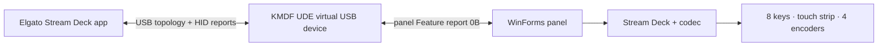

# MirageDeck

An independent **Elgato Stream Deck +** emulator for Windows 11. It creates a
virtual HID with `VID 0FD9 / PID 0084` and renders its keys, touch strip, and
encoders in a separate WinForms panel.

> [!WARNING]
> This project is intended for development, testing, accessibility, and
> interoperability research. Development packages use a temporary self-signed
> certificate and are not production releases.

## Features

- Stream Deck + `20GBD9901` profile: 8 LCD keys, an `800×100` touch strip, and
  4 push encoders;
- key state, encoder button/rotation, and `TAP`, `PRESS`, `FLICK` input reports;
- chunked JPEG uploads for a key, the full LCD, the full touch strip, and a
  rectangular touch-strip region;
- feature reports for logo, LCD/key color fill, brightness, and sleep duration;
- firmware, serial number, unit geometry, and sleep-duration responses;
- a 32-byte chunked panel feature report that does not alter the maximum public
  HID report sizes;
- cross-platform protocol codec tests.

The implementation follows Elgato's official
[Stream Deck HID API](https://docs.elgato.com/streamdeck/hid/stream-deck-plus/).

## Quick start

> [!IMPORTANT]
> Installing a development package adds its public certificate to
> `LocalMachine\Root` and `LocalMachine\TrustedPublisher`. The installer shows
> the certificate identity, expiry, and SHA-256 fingerprint and continues only
> after `INSTALL` is entered. MirageDeck uses a kernel-mode UDE driver to expose
> a complete USB topology. A self-signed development build only runs in Windows
> Test Mode, which is unavailable while Secure Boot is enabled.

1. Download the latest successful artifact from
   [Actions → Build Windows package](https://github.com/Nekit678/MirageDeck/actions/workflows/build-windows.yml).
2. Extract the ZIP completely.
3. Open an elevated PowerShell in the package directory:

   ```powershell
   Set-ExecutionPolicy -Scope Process Bypass
   .\scripts\verify-package.ps1
   .\scripts\install-driver.ps1 -DriverDirectory .\driver
   ```

   If the installer reports that Test Mode is disabled, run
   `bcdedit.exe /set testsigning on`, restart Windows, and install again. If
   Secure Boot protects that setting, disable it in UEFI first. A production
   package needs Microsoft driver signing.

4. Start `panel\MirageDeck.exe`, wait for
   `HID 0FD9:0084 (Stream Deck +) готов к работе`, and then start the Elgato
   Stream Deck app. Restart Windows first if requested by the installer.

### Building from source

You need Windows 11 22H2+, Visual Studio 2022 with Desktop development with C++,
the Windows 11 SDK, WDK, and .NET 8 SDK. In Developer PowerShell for VS 2022:

```powershell
Set-ExecutionPolicy -Scope Process Bypass
.\scripts\build.ps1 Debug
dotnet run --project .\test\Mirabox.Emulator.Core.Tests -c Release
$certificate = Get-ChildItem .\driver\x64\Debug -Filter *.cer -Recurse | Select-Object -First 1
.\scripts\install-driver.ps1 -DriverDirectory .\driver\x64\Debug -TestCertificatePath $certificate.FullName
dotnet run --project .\src\Mirabox.Emulator.Panel -c Release
```

## Panel controls

| Element | Mouse action | HID event |
| --- | --- | --- |
| LCD key | press / release | complete 8-key state array |
| Encoder | press / release | complete 4-encoder state array |
| Encoder | mouse wheel | `ROTATE`, −1 / +1 tick |
| Touch strip | short click | `TAP` |
| Touch strip | hold for at least 500 ms | `PRESS` |
| Touch strip | drag and release | `FLICK` from start to end |

## Architecture



| Directory | Purpose |
| --- | --- |
| [`driver/`](driver/) | KMDF/UDE virtual USB HID `0FD9:0084` |
| [`src/Mirabox.Emulator.Core/`](src/Mirabox.Emulator.Core/) | profile, input reports, and decoder |
| [`src/Mirabox.Emulator.Panel/`](src/Mirabox.Emulator.Panel/) | Windows panel and private channel |
| [`test/`](test/) | report generation and decoder tests |
| [`docs/PROTOCOL.md`](docs/PROTOCOL.md) | implemented HID API details |

## Limitations

- MirageDeck emulates the USB device/configuration/interface/endpoint
  descriptors and the `0FD9:0084` HID function; external USB hubs are not
  emulated.
- The panel uses a 500 ms `PRESS` threshold; hardware firmware may differ.
- The `800×480` full-LCD image is represented by an abstract panel layout; the
  exact physical bezel/window geometry is not reproduced.
- The driver and Elgato app integration require validation on Windows; only the
  protocol core is tested cross-platform.

## Removal

Run in an elevated PowerShell:

```powershell
.\scripts\uninstall-driver.ps1
```

To also remove the package from Driver Store:

```powershell
.\scripts\uninstall-driver.ps1 -RemoveDriverPackage
```

## Legal

MirageDeck is an independent interoperability project. It is not affiliated
with, authorized by, or endorsed by Elgato, Corsair, Microsoft, or USB-IF.
Elgato, Stream Deck +, and `VID 0FD9 / PID 0084` are used only to identify
compatibility; those identifiers are not assigned to MirageDeck.

The distribution contains no Elgato firmware or binaries, private signing
keys, or extracted proprietary assets. Original code is MIT-licensed. The
driver uses the Windows in-box UdeCx extension, which is not redistributed.
See [`THIRD_PARTY_NOTICES.md`](THIRD_PARTY_NOTICES.md).
