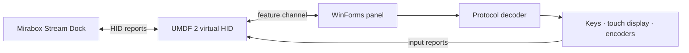

<p align="center">
  
</p>

<h1 align="center">MirageDeck</h1>

<p align="center">
  An independent N4 Pro-compatible virtual HID for Windows 11.<br>
  Selected-profile emulation, an on-screen control panel, and testing tools.
</p>

<p align="center">
  <a href="README.md">Русский</a> · <a href="README.en.md">English</a>
</p>

<p align="center">
  <a href="https://github.com/Nekit678/MirageDeck/actions/workflows/build-windows.yml"></a>
  
  
  
</p>

> [!WARNING]
> **MirageDeck 1.x is at an early stage.** The main workflows are operational, but bugs, incompatibilities with specific Stream Dock versions, and unrecognized protocol commands are still possible. GitHub Actions artifacts are for development and testing; they are not production releases. Read [Limitations](#limitations) before installing one.

MirageDeck creates a virtual Windows HID device using the global **Mirabox N4ProE `5548:1021`** profile. The official Stream Dock application recognizes it as regular hardware and sends key and touch-display artwork. A separate WinForms application renders that artwork and sends key presses, encoder input, and touch gestures back to Stream Dock.

## Demo

<p align="center">
  
</p>

<p align="center"><sub>A static preview of the current interface. In the running panel, key and touch-display artwork comes directly from Stream Dock.</sub></p>

```text
Stream Dock ──artwork and commands──▶ virtual HID ──▶ MirageDeck panel
Stream Dock ◀──keys, encoders, gestures── virtual HID ◀── MirageDeck panel
```

## Features

- a virtual **UMDF 2 HID minidriver** implementing selected behavior of the N4 Pro `02.009` firmware profile;
- 10 LCD keys, 4 pushable encoders, and a touch display with two operating modes;
- rendering of PNG, JPEG, and raw BGR24 artwork sent by Stream Dock;
- key down/up events, encoder presses, and encoder rotation;
- Button Mode with 4 encoder display actions and horizontal page swipes;
- Touchbar Mode with coordinate touches, taps, and horizontal dragging;
- brightness, clear, wake, and automatic protocol-driven mode switching;
- a streaming decoder for `BAT`, `LOG`, `BGPIC`, `MOD`, `LIG`, `CLE`, `DIS`, and `STP`;
- cross-platform core tests and a development `win-x64` package from GitHub Actions.

## Quick start

> [!IMPORTANT]
> The development/CI package uses a dedicated ephemeral self-signed certificate. Before importing its public part, the installer re-verifies the package, displays its subject, issuer, expiry, and SHA-256 fingerprint, and requires you to type `INSTALL`. Importing it changes the machine-wide `Root` and `TrustedPublisher` stores, so administrator privileges are required. MirageDeck uses UMDF 2 and contains no custom kernel-mode `.sys`: **you do not need to enable Test Mode or disable Secure Boot**. Enterprise WDAC/App Control policy may still block the package. Only install artifacts from trusted runs of the official workflow.

### GitHub Actions development package

1. Open **[Actions → Build Windows package](https://github.com/Nekit678/MirageDeck/actions/workflows/build-windows.yml)**.
2. Select the latest successful run and download the `MirageDeck-development-win-x64` artifact.
3. Extract the ZIP completely into a dedicated directory.
4. Open an elevated PowerShell window in the extracted package directory:

   ```powershell
   Set-ExecutionPolicy -Scope Process Bypass
   .\scripts\verify-package.ps1
   .\scripts\install-driver.ps1 -DriverDirectory .\driver
   ```

5. Start `panel\MirageDeck.exe`, wait for the **“ГОТОВО” (ready)** status, and then launch Stream Dock. If the installer requests a restart, complete it before starting the panel.

`install-driver.ps1` runs verification again before changing the system; the separate `verify-package.ps1` command lets you inspect the result first. The artifact also contains a detailed `START-HERE.md`. GitHub Actions artifacts are retained for 30 days; the source ZIP from the **Code** menu is not a ready-to-run build.

### Build from source

Requirements:

- Windows 11 22H2 or newer;
- Visual Studio 2022 with **Desktop development with C++**;
- Windows 11 SDK and Windows Driver Kit (WDK);
- .NET 8 SDK;
- administrator privileges for driver installation.

Run in **Developer PowerShell for VS 2022**:

```powershell
Set-ExecutionPolicy -Scope Process Bypass
.\scripts\build.ps1 Debug
dotnet run --project .\test\Mirabox.Emulator.Core.Tests -c Release
$certificate = Get-ChildItem .\driver\x64\Debug -Filter *.cer -Recurse | Select-Object -First 1
.\scripts\install-driver.ps1 -DriverDirectory .\driver\x64\Debug -TestCertificatePath $certificate.FullName
dotnet run --project .\src\Mirabox.Emulator.Panel -c Release
```

The certificate path is explicit for local builds; the installer never imports an arbitrary `.cer` merely because it is next to the INF.

## Controls

| Panel element | Mouse action | Device event |
| --- | --- | --- |
| LCD key | press and release | key down / key up |
| Encoder | click | hardware press |
| Encoder | mouse wheel over the knob | rotate left / right |
| Touch display, Button Mode | click one of 4 segments | encoder display action |
| Touch display, Button Mode | horizontal swipe | previous / next page |
| Touch display, Touchbar Mode | tap | activate item at coordinate |
| Touch display, Touchbar Mode | horizontal drag | sequence of `ARX` coordinates |

Stream Dock selects the touch-display mode. On physical N4 Pro hardware, a vertical swipe is handled locally by firmware and has no separate HID input code, so MirageDeck cannot use that gesture to switch the application's mode.

## Architecture



| Directory | Purpose |
| --- | --- |
| [`driver/`](driver/) | virtual UMDF 2 HID driver |
| [`src/Mirabox.Emulator.Core/`](src/Mirabox.Emulator.Core/) | device profile, input reports, and protocol decoder |
| [`src/Mirabox.Emulator.Panel/`](src/Mirabox.Emulator.Panel/) | Windows panel and private HID channel |
| [`test/`](test/) | standalone packet generation and decoding tests |
| [`scripts/`](scripts/) | build, packaging, verification, installation, and removal |
| [`docs/PROTOCOL.md`](docs/PROTOCOL.md) | documented N4 Pro protocol details |

## Limitations

- Only the global **N4ProE `VID_5548&PID_1021`** is supported. The mainland-China PID `1008` variant and other Mirabox models use different profiles.
- Compatibility may depend on the Stream Dock version. Unknown commands are safely returned as `UnknownCommandUpdate`, but their behavior is not implemented yet.
- The driver emulates the HID function, not the physical composite device's USB topology or USB descriptors. Software that validates the USB parent may not discover MirageDeck.
- GitHub Actions publishes only a development artifact with a locally trusted self-signed certificate. A public release that does not add a custom root certificate must use the current applicable Microsoft Hardware Developer Program process (for example, HLK/WHQL or attestation signing when the target scenario meets Microsoft's current eligibility rules).
- The project is tested on Windows 11 x64; other Windows versions and architectures are not currently supported targets.

## Uninstall

Run in an elevated PowerShell window:

```powershell
.\scripts\uninstall-driver.ps1
```

The script removes the virtual device and only the current package certificate by its exact SHA-1 thumbprint from `PACKAGE-INFO.json`; certificates with a similar subject are not touched. To intentionally retain that certificate:

```powershell
.\scripts\uninstall-driver.ps1 -KeepTestCertificate
```

The driver remains in the Driver Store by default. To remove it explicitly:

```powershell
.\scripts\uninstall-driver.ps1 -RemoveDriverPackage
```

## Roadmap

- fix discovered bugs and Stream Dock regressions;
- expand coverage of unknown protocol commands;
- improve connection diagnostics and logging;
- streamline signed and versioned releases;
- extend automated driver and UI testing.

Found a bug? Open an [issue](https://github.com/Nekit678/MirageDeck/issues) and include your Windows version, Stream Dock version, reproduction steps, and a HID trace when possible. See [`docs/PROTOCOL.md`](docs/PROTOCOL.md) for guidance on investigating unknown packets.

## Legal and interoperability notice

MirageDeck is an independent interoperability and testing project. It is not affiliated with, authorized by, endorsed by, or sponsored by Mirabox, HOTSPOTEK, Microsoft, or USB-IF.

MirageDeck implements a virtual HID device compatible with selected observable behavior of the Mirabox Stream Dock N4 Pro. Emulated identifiers such as `VID 5548 / PID 1021`, firmware-version strings, and device strings are exposed only where required for software compatibility. They are not assigned to MirageDeck and do not indicate ownership, authorization, endorsement, or USB-IF certification. MirageDeck does not use the USB logo and is not presented as a physical USB product.

MirageDeck is intended for legitimate development, testing, accessibility, research, and interoperability. The distribution does not include Mirabox firmware, Stream Dock binaries, private signing keys, confidential documentation, or extracted proprietary assets.

Mirabox, Stream Dock, N4 Pro, Microsoft, Windows, USB, and other names or marks are the property of their respective owners and are used only to identify compatibility or third-party component origins.

Original MirageDeck code is distributed under the [MIT License](LICENSE), except for specifically identified derivative files. `driver/vhidmini.c`, `driver/vhidmini.h`, and `driver/util.c` contain portions of Microsoft's `vhidmini2` sample and are distributed under the [MS-PL](driver/LICENSE-MS-PL). See [THIRD_PARTY_NOTICES.md](THIRD_PARTY_NOTICES.md) for complete notices.
