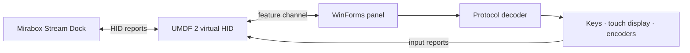

<p align="center">
  
</p>

<h1 align="center">MirageDeck</h1>

<p align="center">
  A virtual Mirabox Stream Dock N4 Pro for Windows 11.<br>
  Full HID emulation, an on-screen control panel, and no physical device required.
</p>

<p align="center">
  <a href="README.md">Русский</a> · <a href="README.en.md">English</a>
</p>

<p align="center">
  <a href="https://github.com/Nekit678/MiraboxHIDEmulator/actions/workflows/build-windows.yml"></a>
  
  
  
</p>

> [!WARNING]
> **MirageDeck 1.x is the project's first public major release.** The main workflows are operational, but bugs, incompatibilities with specific Stream Dock versions, and unrecognized protocol commands are still possible. The project will continue to receive fixes, compatibility improvements, and new features. Read [Limitations](#limitations) before installing it.

MirageDeck creates a virtual Windows HID device using the global **Mirabox N4ProE `5548:1021`** profile. The official Stream Dock application recognizes it as regular hardware and sends key and touch-display artwork. A separate WinForms application renders that artwork and sends key presses, encoder input, and touch gestures back to Stream Dock.

## Demo

<p align="center">
  
</p>

<p align="center"><sub>A static preview of the current interface. In the running panel, key and touch-display artwork comes directly from Stream Dock.</sub></p>

```text
Stream Dock ──artwork and commands──▶ virtual HID ──▶ MirageDeck panel
Stream Dock ◀──keys, encoders, gestures── virtual HID ◀── MirageDeck panel
```

## Features

- a virtual **UMDF 2 HID minidriver** matching the N4 Pro `02.009` firmware profile;
- 10 LCD keys, 4 pushable encoders, and a touch display with two operating modes;
- rendering of PNG, JPEG, and raw BGR24 artwork sent by Stream Dock;
- key down/up events, encoder presses, and encoder rotation;
- Button Mode with 4 encoder display actions and horizontal page swipes;
- Touchbar Mode with coordinate touches, taps, and horizontal dragging;
- brightness, clear, wake, and automatic protocol-driven mode switching;
- a streaming decoder for `BAT`, `LOG`, `BGPIC`, `MOD`, `LIG`, `CLE`, `DIS`, and `STP`;
- cross-platform core tests and a ready-to-install `win-x64` package from GitHub Actions.

## Quick start

> [!IMPORTANT]
> The CI package uses an ephemeral self-signed certificate. The installer adds its public part to the machine-wide `Root` and `TrustedPublisher` stores, so administrator privileges are required. MirageDeck uses UMDF 2 and contains no custom kernel-mode `.sys`: **you do not need to enable Test Mode or disable Secure Boot**. Only install packages from a CI run you trust.

### Ready-made GitHub Actions package

1. Open **[Actions → Build Windows package](https://github.com/Nekit678/MiraboxHIDEmulator/actions/workflows/build-windows.yml)**.
2. Select the latest successful run and download the `MiraboxHIDEmulator-win-x64` artifact.
3. Extract the ZIP completely into a dedicated directory.
4. Open an elevated PowerShell window in the extracted package directory:

   ```powershell
   Set-ExecutionPolicy -Scope Process Bypass
   .\scripts\verify-package.ps1
   .\scripts\install-driver.ps1 -DriverDirectory .\driver
   ```

5. Start `panel\MiraboxEmulator.exe`, wait for the **“ГОТОВО” (ready)** status, and then launch Stream Dock. If the installer requests a restart, complete it before starting the panel.

The artifact also contains a detailed `START-HERE.md`. GitHub Actions artifacts are retained for 30 days; the source ZIP from the **Code** menu is not a ready-to-run build.

### Build from source

Requirements:

- Windows 11 22H2 or newer;
- Visual Studio 2022 with **Desktop development with C++**;
- Windows 11 SDK and Windows Driver Kit (WDK);
- .NET 8 SDK;
- administrator privileges for driver installation.

Run in **Developer PowerShell for VS 2022**:

```powershell
Set-ExecutionPolicy -Scope Process Bypass
.\scripts\build.ps1 Debug
dotnet run --project .\test\Mirabox.Emulator.Core.Tests -c Release
.\scripts\install-driver.ps1 -DriverDirectory .\driver\x64\Debug
dotnet run --project .\src\Mirabox.Emulator.Panel -c Release
```

## Controls

| Panel element | Mouse action | Device event |
| --- | --- | --- |
| LCD key | press and release | key down / key up |
| Encoder | click | hardware press |
| Encoder | mouse wheel over the knob | rotate left / right |
| Touch display, Button Mode | click one of 4 segments | encoder display action |
| Touch display, Button Mode | horizontal swipe | previous / next page |
| Touch display, Touchbar Mode | tap | activate item at coordinate |
| Touch display, Touchbar Mode | horizontal drag | sequence of `ARX` coordinates |

Stream Dock selects the touch-display mode. On physical N4 Pro hardware, a vertical swipe is handled locally by firmware and has no separate HID input code, so MirageDeck cannot use that gesture to switch the application's mode.

## Architecture



| Directory | Purpose |
| --- | --- |
| [`driver/`](driver/) | virtual UMDF 2 HID driver |
| [`src/Mirabox.Emulator.Core/`](src/Mirabox.Emulator.Core/) | device profile, input reports, and protocol decoder |
| [`src/Mirabox.Emulator.Panel/`](src/Mirabox.Emulator.Panel/) | Windows panel and private HID channel |
| [`test/`](test/) | standalone packet generation and decoding tests |
| [`scripts/`](scripts/) | build, packaging, verification, installation, and removal |
| [`docs/PROTOCOL.md`](docs/PROTOCOL.md) | documented N4 Pro protocol details |

## Limitations

- Only the global **N4ProE `VID_5548&PID_1021`** is supported. The mainland-China PID `1008` variant and other Mirabox models use different profiles.
- Compatibility may depend on the Stream Dock version. Unknown commands are safely returned as `UnknownCommandUpdate`, but their behavior is not implemented yet.
- The driver emulates the HID function, not the physical composite device's USB topology or USB descriptors. Software that validates the USB parent may not discover MirageDeck.
- Public packages currently use a locally trusted self-signed certificate. Test Mode is not required for the current UMDF driver, but enterprise WDAC/App Control policies may still reject the package. Distribution without adding a certificate to the system trust stores requires a release signature already trusted by Windows, such as Microsoft attestation/WHQL.
- The project is tested on Windows 11 x64; other Windows versions and architectures are not currently supported targets.

## Uninstall

Run in an elevated PowerShell window:

```powershell
.\scripts\uninstall-driver.ps1
```

The script removes the virtual device and every certificate with the project-specific subject `CN=Mirabox HID Emulator Test` from `Root` and `TrustedPublisher`. To intentionally retain the certificates:

```powershell
.\scripts\uninstall-driver.ps1 -KeepTestCertificate
```

## Roadmap

- fix discovered bugs and Stream Dock regressions;
- expand coverage of unknown protocol commands;
- improve connection diagnostics and logging;
- streamline signed and versioned releases;
- extend automated driver and UI testing.

Found a bug? Open an [issue](https://github.com/Nekit678/MiraboxHIDEmulator/issues) and include your Windows version, Stream Dock version, reproduction steps, and a HID trace when possible. See [`docs/PROTOCOL.md`](docs/PROTOCOL.md) for guidance on investigating unknown packets.

## Acknowledgements and legal notice

The device profile is based on the public [StreamDock Device SDK](https://github.com/MiraboxSpace/StreamDock-Device-SDK) and a verified implementation of the 293-family protocol. The driver layer is based on Microsoft's `vhidmini2` sample; files under [`driver/`](driver/) are distributed under the MS-PL terms in [`driver/LICENSE-MS-PL`](driver/LICENSE-MS-PL).

MirageDeck is an independent project and is not affiliated with Mirabox, HOTSPOTEK, or Microsoft. Product names and trademarks belong to their respective owners.
