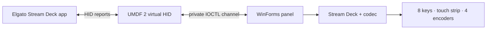

# MirageDeck

Независимый эмулятор **Elgato Stream Deck +** для Windows 11. Проект создаёт
виртуальный HID с идентификаторами `VID 0FD9 / PID 0084` и показывает его
клавиши, touch strip и энкодеры в отдельной WinForms-панели.

> [!WARNING]
> Проект предназначен для разработки, тестирования, accessibility и
> исследований совместимости. Development-пакеты подписаны временным
> самоподписанным сертификатом и не являются production release.

## Возможности

- профиль Stream Deck + `20GBD9901`: 8 LCD-клавиш, touch strip `800×100` и
  4 нажимаемых энкодера;
- input reports клавиш, нажатий/вращений энкодеров и жестов `TAP`, `PRESS`,
  `FLICK`;
- загрузка JPEG для отдельной клавиши, полного LCD, всего touch strip и его
  прямоугольной области;
- feature reports: логотип, заливка LCD/клавиши, яркость и таймер сна;
- ответы на запросы firmware, серийного номера, geometry и sleep duration;
- изолированный служебный device interface между драйвером и панелью — он не
  меняет публичные размеры HID reports;
- автономные кроссплатформенные тесты кодека протокола.

Форматы реализованы по официальной документации
[Stream Deck HID API](https://docs.elgato.com/streamdeck/hid/stream-deck-plus/).

## Быстрый старт

> [!IMPORTANT]
> Установка development-пакета добавляет его публичный сертификат в
> `LocalMachine\Root` и `LocalMachine\TrustedPublisher`. Установщик показывает
> subject, issuer, срок действия и SHA-256 fingerprint и продолжает только
> после ввода `INSTALL`. MirageDeck использует UMDF 2 и не содержит собственного
> kernel-mode `.sys`; Test Mode и отключение Secure Boot не требуются.

1. Скачайте последний успешный артефакт из
   [Actions → Build Windows package](https://github.com/Nekit678/MirageDeck/actions/workflows/build-windows.yml).
2. Полностью распакуйте ZIP.
3. Откройте PowerShell от имени администратора в папке пакета:

   ```powershell
   Set-ExecutionPolicy -Scope Process Bypass
   .\scripts\verify-package.ps1
   .\scripts\install-driver.ps1 -DriverDirectory .\driver
   ```

4. Запустите `panel\MirageDeck.exe`, дождитесь сообщения
   `HID 0FD9:0084 (Stream Deck +) готов к работе`, затем откройте приложение
   Elgato Stream Deck. Если установщик запросил перезагрузку, сначала выполните её.

### Сборка из исходников

Нужны Windows 11 22H2+, Visual Studio 2022 с Desktop development with C++,
Windows 11 SDK, WDK и .NET 8 SDK. В Developer PowerShell for VS 2022:

```powershell
Set-ExecutionPolicy -Scope Process Bypass
.\scripts\build.ps1 Debug
dotnet run --project .\test\Mirabox.Emulator.Core.Tests -c Release
$certificate = Get-ChildItem .\driver\x64\Debug -Filter *.cer -Recurse | Select-Object -First 1
.\scripts\install-driver.ps1 -DriverDirectory .\driver\x64\Debug -TestCertificatePath $certificate.FullName
dotnet run --project .\src\Mirabox.Emulator.Panel -c Release
```

## Управление панелью

| Элемент | Действие мышью | HID-событие |
| --- | --- | --- |
| LCD-клавиша | нажать / отпустить | полный массив состояний 8 клавиш |
| Энкодер | нажать / отпустить | полный массив состояний 4 энкодеров |
| Энкодер | колесо мыши | `ROTATE`, −1 / +1 tick |
| Touch strip | короткий щелчок | `TAP` |
| Touch strip | удержание от 500 мс | `PRESS` |
| Touch strip | drag и отпускание | `FLICK` от начальной до конечной точки |

## Архитектура



| Каталог | Назначение |
| --- | --- |
| [`driver/`](driver/) | UMDF 2 виртуальный HID `0FD9:0084` |
| [`src/Mirabox.Emulator.Core/`](src/Mirabox.Emulator.Core/) | профиль, input reports и decoder |
| [`src/Mirabox.Emulator.Panel/`](src/Mirabox.Emulator.Panel/) | Windows-панель и служебный канал |
| [`test/`](test/) | тесты формирования и декодирования reports |
| [`docs/PROTOCOL.md`](docs/PROTOCOL.md) | реализованная часть HID API |

## Ограничения

- Эмулируется HID-функция Stream Deck + `0FD9:0084`, но не физическая USB
  topology. Приложения, проверяющие USB parent или дополнительные интерфейсы,
  могут не обнаружить устройство.
- Порог `PRESS` в панели установлен в 500 мс; аппаратный порог firmware может
  отличаться.
- Полный LCD-кадр `800×480` отображается в абстрактной раскладке панели; точная
  геометрия просветов физического корпуса не воспроизводится.
- Драйвер и интеграция с приложением Elgato требуют проверки на Windows;
  кроссплатформенно тестируется только ядро протокола.

## Удаление

В PowerShell от имени администратора:

```powershell
.\scripts\uninstall-driver.ps1
```

Чтобы также удалить пакет из Driver Store:

```powershell
.\scripts\uninstall-driver.ps1 -RemoveDriverPackage
```

## Правовая информация

MirageDeck — независимый проект совместимости. Он не связан с Elgato, Corsair,
Microsoft или USB-IF, не авторизован и не одобрен ими. Названия Elgato и
Stream Deck +, а также `VID 0FD9 / PID 0084` используются только для описания
совместимости; эти идентификаторы не выделены MirageDeck.

Дистрибутив не содержит firmware или binaries Elgato, приватных ключей либо
извлечённых proprietary assets. Оригинальный код распространяется по MIT;
файлы драйвера, производные от Microsoft `vhidmini2`, — по MS-PL. См.
[`THIRD_PARTY_NOTICES.md`](THIRD_PARTY_NOTICES.md).
