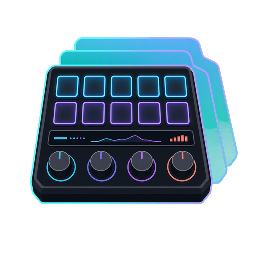
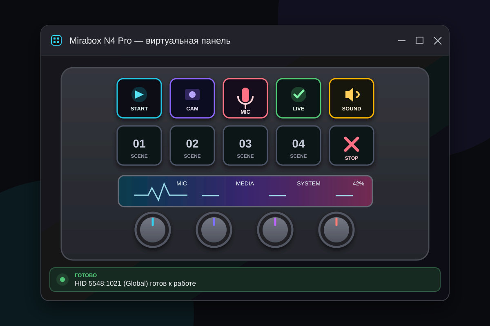
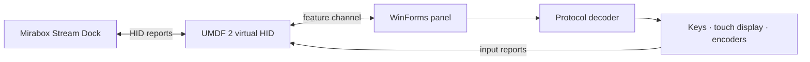

<p align="center">
  
</p>

<h1 align="center">MirageDeck</h1>

<p align="center">
  Независимый N4 Pro-совместимый виртуальный HID для Windows 11.<br>
  Эмуляция выбранного HID-профиля, экранная панель и инструменты тестирования.
</p>

<p align="center">
  <a href="README.md">Русский</a> · <a href="README.en.md">English</a>
</p>

<p align="center">
  <a href="https://github.com/Nekit678/MiraboxHIDEmulator/actions/workflows/build-windows.yml"></a>
  
  
  
</p>

> [!WARNING]
> **MirageDeck 1.x находится на ранней стадии.** Основные сценарии уже работают, но возможны ошибки, несовместимость с отдельными версиями Stream Dock и ещё не изученные команды протокола. Артефакты GitHub Actions предназначены для разработки и тестирования и не являются production release. Перед установкой прочитайте раздел [«Ограничения»](#ограничения).

MirageDeck создаёт в Windows виртуальное HID-устройство с профилем глобального **Mirabox N4ProE `5548:1021`**. Официальное приложение Stream Dock распознаёт его как обычную аппаратную панель, отправляет изображения клавиш и touch bar, а отдельное WinForms-приложение показывает их на экране и возвращает нажатия, вращения энкодеров и жесты.

## Демонстрация

<p align="center">
  
</p>

<p align="center"><sub>Статический предпросмотр текущего интерфейса. Изображения клавиш и touch bar в работающей панели поступают непосредственно из Stream Dock.</sub></p>

```text
Stream Dock ──изображения и команды──▶ виртуальный HID ──▶ панель MirageDeck
Stream Dock ◀──клавиши, энкодеры, жесты── виртуальный HID ◀── панель MirageDeck
```

## Возможности

- виртуальный **UMDF 2 HID minidriver**, реализующий выбранное поведение профиля N4 Pro firmware `02.009`;
- 10 LCD-клавиш, 4 нажимаемых энкодера и сенсорный экран с двумя режимами;
- отображение PNG, JPEG и raw BGR24, переданных приложением Stream Dock;
- нажатия и отпускания клавиш, клики и вращение энкодеров;
- Button Mode: 4 экранные функции энкодеров и горизонтальные свайпы между страницами;
- Touchbar Mode: координатные касания, тапы и горизонтальный drag;
- яркость, очистка, пробуждение экрана и автоматическое переключение режима по командам протокола;
- потоковый декодер команд `BAT`, `LOG`, `BGPIC`, `MOD`, `LIG`, `CLE`, `DIS` и `STP`;
- кроссплатформенные тесты ядра и тестовый `win-x64` пакет из GitHub Actions.

## Быстрый старт

> [!IMPORTANT]
> Development/CI-пакет подписан отдельным временным самоподписанным сертификатом. Перед импортом его публичной части установщик повторно проверяет пакет, показывает subject, issuer, срок действия и SHA-256 fingerprint и требует ввести `INSTALL`. Импорт изменяет системные хранилища `Root` и `TrustedPublisher`, поэтому нужны права администратора. MirageDeck использует UMDF 2 и не содержит собственного kernel-mode `.sys`: **Test Mode включать и Secure Boot отключать не требуется**. Корпоративные WDAC/App Control policies всё равно могут заблокировать пакет. Устанавливайте только артефакты из доверенных запусков официального workflow.

### Development-пакет из GitHub Actions

1. Откройте **[Actions → Build Windows package](https://github.com/Nekit678/MiraboxHIDEmulator/actions/workflows/build-windows.yml)**.
2. Выберите последний успешный запуск и скачайте артефакт `MirageDeck-development-win-x64`.
3. Полностью распакуйте ZIP в отдельную папку.
4. Откройте PowerShell от имени администратора в папке пакета:

   ```powershell
   Set-ExecutionPolicy -Scope Process Bypass
   .\scripts\verify-package.ps1
   .\scripts\install-driver.ps1 -DriverDirectory .\driver
   ```

5. Запустите `panel\MirageDeck.exe`, дождитесь статуса **«ГОТОВО»**, затем откройте Stream Dock. Если установщик запросил перезагрузку, выполните её перед запуском панели.

`install-driver.ps1` сам запускает проверку до изменения системы; отдельный запуск `verify-package.ps1` оставлен в инструкции, чтобы результат можно было изучить заранее. Подробная инструкция находится в `START-HERE.md`. Артефакты GitHub Actions хранятся 30 дней; ZIP с исходным кодом из меню **Code** не является готовой сборкой.

### Сборка из исходников

Понадобятся:

- Windows 11 22H2 или новее;
- Visual Studio 2022 с компонентом **Desktop development with C++**;
- Windows 11 SDK и Windows Driver Kit (WDK);
- .NET 8 SDK;
- права администратора для установки драйвера.

В **Developer PowerShell for VS 2022**:

```powershell
Set-ExecutionPolicy -Scope Process Bypass
.\scripts\build.ps1 Debug
dotnet run --project .\test\Mirabox.Emulator.Core.Tests -c Release
$certificate = Get-ChildItem .\driver\x64\Debug -Filter *.cer -Recurse | Select-Object -First 1
.\scripts\install-driver.ps1 -DriverDirectory .\driver\x64\Debug -TestCertificatePath $certificate.FullName
dotnet run --project .\src\Mirabox.Emulator.Panel -c Release
```

Для локальной сборки certificate path передаётся явно; установщик никогда не импортирует произвольный `.cer`, найденный рядом с INF.

## Управление

| Элемент панели | Действие мышью | Событие устройства |
| --- | --- | --- |
| LCD-клавиша | нажать и отпустить | key down / key up |
| Энкодер | щелчок | аппаратное нажатие |
| Энкодер | колесо мыши над ручкой | вращение влево / вправо |
| Touch display, Button Mode | щелчок по одному из 4 сегментов | функция энкодера |
| Touch display, Button Mode | горизонтальный свайп | предыдущая / следующая страница |
| Touch display, Touchbar Mode | тап | активация элемента по координате |
| Touch display, Touchbar Mode | горизонтальный drag | последовательность `ARX`-координат |

Режим touch display выбирает Stream Dock. У физического N4 Pro вертикальный свайп обрабатывается самой прошивкой и не имеет отдельного HID-кода, поэтому MirageDeck не может переключать режим приложения таким жестом.

## Как это устроено



| Каталог | Назначение |
| --- | --- |
| [`driver/`](driver/) | виртуальный UMDF 2 HID-драйвер |
| [`src/Mirabox.Emulator.Core/`](src/Mirabox.Emulator.Core/) | профиль устройства, input reports и декодер протокола |
| [`src/Mirabox.Emulator.Panel/`](src/Mirabox.Emulator.Panel/) | Windows-панель и служебный HID-канал |
| [`test/`](test/) | автономные тесты формирования и декодирования пакетов |
| [`scripts/`](scripts/) | сборка, упаковка, проверка, установка и удаление |
| [`docs/PROTOCOL.md`](docs/PROTOCOL.md) | исследованная часть протокола N4 Pro |

## Ограничения

- Поддерживается только глобальный **N4ProE `VID_5548&PID_1021`**. Китайский вариант с PID `1008` и другие модели Mirabox имеют отличающиеся профили.
- Совместимость может зависеть от версии Stream Dock. Неизвестные команды безопасно возвращаются как `UnknownCommandUpdate`, но их эффект ещё не реализован.
- Драйвер эмулирует HID-функцию, но не USB topology и USB descriptors физического composite-устройства. Программы, проверяющие USB parent, могут не обнаружить MirageDeck.
- GitHub Actions публикует только development-артефакт с локально доверенным самоподписанным сертификатом. Публичный release без добавления собственного корневого сертификата должен пройти актуальный применимый процесс Microsoft Hardware Developer Program (например, HLK/WHQL либо attestation signing, если целевой сценарий соответствует действующим требованиям Microsoft).
- Проект тестировался на Windows 11 x64; другие версии и архитектуры пока не заявлены как поддерживаемые.

## Удаление

В PowerShell от имени администратора:

```powershell
.\scripts\uninstall-driver.ps1
```

Скрипт удаляет виртуальное устройство и только сертификат текущего пакета по точному SHA-1 thumbprint из `PACKAGE-INFO.json`; другие сертификаты с похожим subject не затрагиваются. Чтобы намеренно сохранить сертификат:

```powershell
.\scripts\uninstall-driver.ps1 -KeepTestCertificate
```

Драйвер остаётся в Driver Store по умолчанию. Для его явного удаления:

```powershell
.\scripts\uninstall-driver.ps1 -RemoveDriverPackage
```

## Планы

- исправлять найденные ошибки и регрессии Stream Dock;
- расширять покрытие неизвестных команд протокола;
- улучшать диагностику подключения и журналирование;
- упростить выпуск подписанных и версионированных сборок;
- расширять автоматические тесты драйвера и интерфейса.

Нашли ошибку? Создайте [issue](https://github.com/Nekit678/MiraboxHIDEmulator/issues) и приложите версию Windows, версию Stream Dock, шаги воспроизведения и, если возможно, HID-трассировку. Инструкция по исследованию неизвестных пакетов находится в [`docs/PROTOCOL.md`](docs/PROTOCOL.md).

## Правовая информация и совместимость

MirageDeck — независимый проект совместимости и тестирования. Он не связан с Mirabox, HOTSPOTEK, Microsoft или USB-IF, не авторизован, не одобрен и не спонсируется ими.

MirageDeck реализует виртуальное HID-устройство, совместимое с отдельными наблюдаемыми особенностями Mirabox Stream Dock N4 Pro. Эмулируемые идентификаторы `VID 5548 / PID 1021`, версия firmware и отдельные строки устройства возвращаются только там, где это необходимо для программной совместимости. Они не выделены проекту MirageDeck и не означают принадлежность, разрешение, одобрение или USB-IF-сертификацию. MirageDeck не использует логотип USB и не заявляется как физическое USB-устройство.

Проект предназначен для законной разработки, тестирования, accessibility, исследований и совместимости. Дистрибутив не содержит firmware Mirabox, binaries Stream Dock, приватных ключей, конфиденциальной документации или извлечённых proprietary assets.

Названия Mirabox, Stream Dock, N4 Pro, Microsoft, Windows, USB и другие обозначения принадлежат соответствующим владельцам и используются только для описания совместимости или происхождения сторонних компонентов.

Оригинальный код MirageDeck распространяется под [лицензией MIT](LICENSE), кроме явно отмеченных производных файлов. `driver/vhidmini.c`, `driver/vhidmini.h` и `driver/util.c` содержат части примера Microsoft `vhidmini2` и распространяются по [MS-PL](driver/LICENSE-MS-PL). Полные сведения приведены в [THIRD_PARTY_NOTICES.md](THIRD_PARTY_NOTICES.md).
